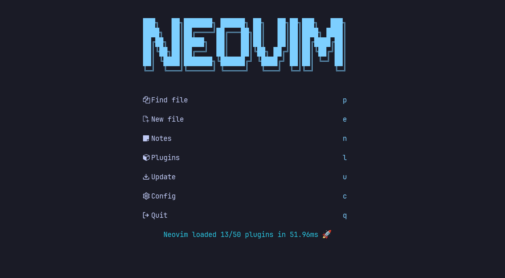

Welcome to my neovim config!

# Setup

To install run the following commands in `$XDG_CONFIG_HOME`

```shell
git clone https://github.com/ethangillengg/nvim
nvim --headless "+Lazy! sync" +qa
```

# TODO

## Plugins

### Must Have

- [x] [lewis6991/gitsigns.nvim](https://github.com/lewis6991/gitsigns.nvim) - Git integration: signs, hunk actions, blame, etc.
- [x] [folke/which-key.nvim](https://github.com/folke/which-key.nvim) - Neovim plugin that shows a popup with possible keybindings of the command you started typing.
- [x] [is0n/fm-nvim](https://github.com/is0n/fm-nvim) - Neovim plugin that lets you use your favorite terminal file managers (and fuzzy finders).
- [x] [stevearc/dressing.nvim](https://github.com/stevearc/dressing.nvim) - Improve the built-in `vim.ui` interfaces with telescope, fzf, etc.
- [x] [folke/neodev.nvim](https://github.com/folke/neodev.nvim)
- [ ] [SmiteshP/nvim-navic](https://github.com/SmiteshP/nvim-navic) - A simple statusline/winbar component that uses LSP to show your current code context.
- [ ] [b0o/incline.nvim](https://github.com/b0o/incline.nvim) - Lightweight floating statuslines, intended for use with Neovim's new global statusline.
- [ ] [RRethy/vim-illuminate](https://github.com/RRethy/vim-illuminate) - Highlight the word under the cursor. Neovim's builtin LSP is available, it can be used to highlight more intelligently.

### Test First

- [x] [weilbith/nvim-code-action-menu](https://github.com/weilbith/nvim-code-action-menu) - A floating pop-up menu for code actions to show code action information and a diff preview.
- [x] [ms-jpq/coq_nvim](https://github.com/ms-jpq/coq_nvim) - Fast as F@%$ Neovim completion. SQLite, concurrent scheduler, hundreds of hours of optimization.
- [ ] [rebelot/heirline.nvim](https://github.com/rebelot/heirline.nvim) - Heirline.nvim is a no-nonsense Neovim Statusline plugin designed around recursive inheritance to be exceptionally fast and versatile.
- [ ] [jubnzv/virtual-types.nvim](https://github.com/jubnzv/virtual-types.nvim) - Show type annotations as virtual text.
- [ ] [lukas-reineke/indent-blankline.nvim](https://github.com/lukas-reineke/indent-blankline.nvim) - IndentLine replacement in Lua with more features and treesitter support.
- [ ] [ray-x/navigator.lua](https://github.com/ray-x/navigator.lua) - Learn existing code quickly and navigate code like a breeze. A swiss army knife makes exploring LSP and 🌲Treesitter symbols a piece of 🍰.
- [ ] [sindrets/diffview.nvim](https://github.com/sindrets/diffview.nvim) - Single tabpage interface for easily cycling through diffs for all modified files for any git rev.
- [ ] [gorbit99/codewindow.nvim](https://github.com/gorbit99/codewindow.nvim) - Minimap plugin, that is closely integrated with treesitter and the builtin LSP to display more information to the user.
- [ ] [mrjones2014/legendary.nvim](https://github.com/mrjones2014/legendary.nvim) - Define your keymaps, commands, and autocommands as simple Lua tables, and create a legend for them at the same time (like VS Code's Command Palette), integrates with `which-key.nvim`.
- [ ] [rktjmp/lush.nvim](https://github.com/rktjmp/lush.nvim)
- [ ] [themercorp/themer.lua](https://github.com/themercorp/themer.lua)
- [ ] [ggandor/leap.nvim](https://github.com/ggandor/leap.nvim);

### Other

- [x] Structure plugins like shown [here](https://github.com/folke/lazy.nvim#-structuring-your-plugins)
- [x] Fix cmp keybindings
- [ ] Document my keymaps in [which-key](https://github.com/folke/which-key.nvim)
